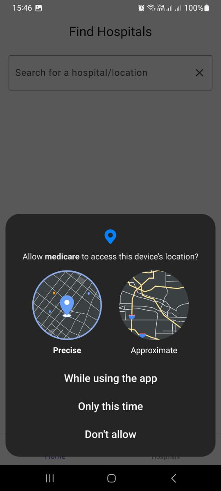
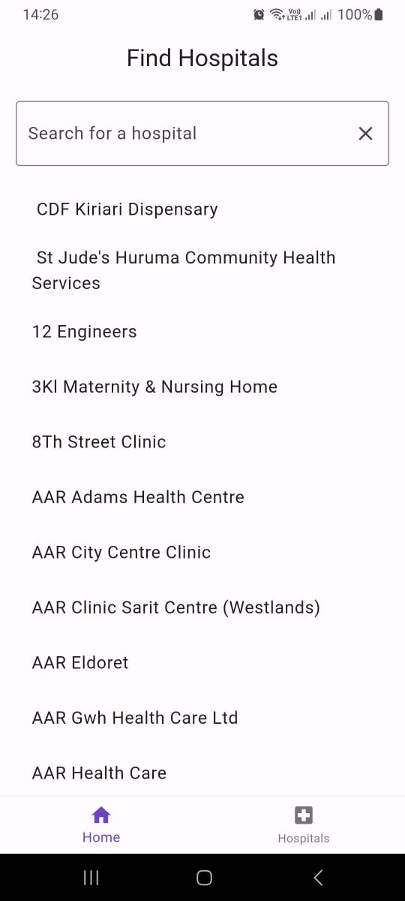
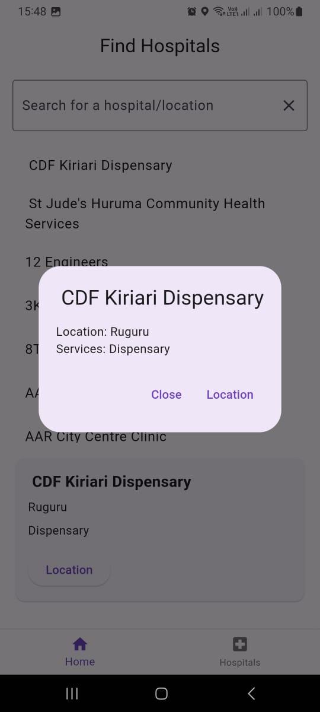
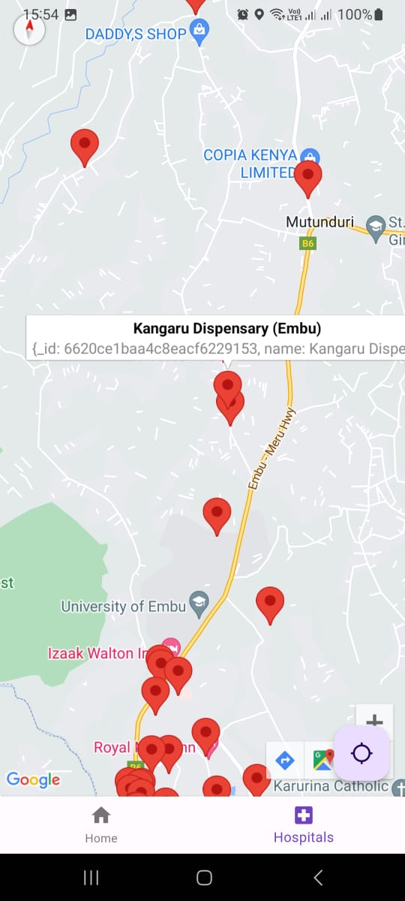
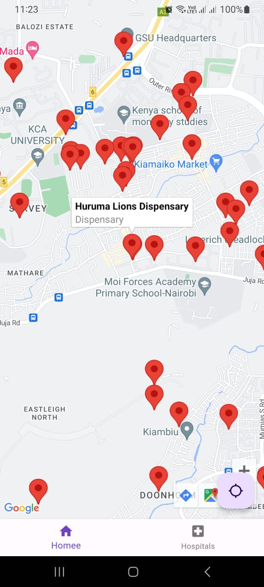

# MediCare - Find Hospitals Near You

MediCare is a Flutter application that helps users find hospitals near their location along with the services each hospital offers.

## Features

- **Hospital Search:** Search for hospitals based on their name or location.
- **Hospital Details:** View details of each hospital including name, location, and services offered.
- **Location-Based:** Display hospitals near the user's current location.

## Screenshots

<div style="display: flex; justify-content: center;">
  
  
</div>

<div style="display: flex; justify-content: center;">
  
  
</div>


<div style="display: flex; justify-content: center;">
  
  
</div>

## Getting Started

1. Clone the repository:

   ```bash
   git clone https://github.com/your_username/medicare.git
2. cd medicare
3. flutter pub get
4. flutter run

*Reach out to me at atatisam14@gmail.com for the API key*